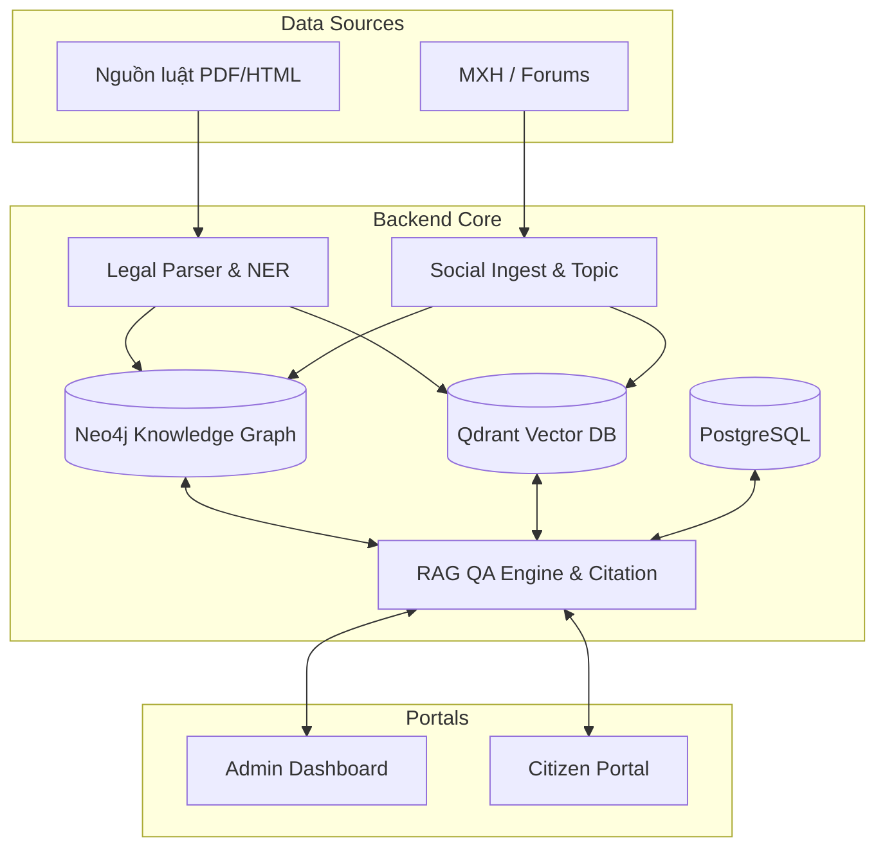

# LexSocial AI
*Được phát triển bởi đội ngũ **CMC 404 Not Found***

> Hệ thống Đồ thị Tri thức Pháp luật & Giám sát Mạng Xã hội

## 📖 Bối cảnh & Mục tiêu

Từ **01/07/2026**, nhiều luật, nghị định, thông tư mới có hiệu lực. Nhu cầu nắm bắt tác động pháp lý nhanh chóng trở nên cấp thiết, đồng thời mạng xã hội bùng nổ thảo luận và dễ nảy sinh các hiểu lầm về quy định mới.

**LexSocial AI** được sinh ra với mục tiêu xây dựng một **Knowledge Graph (Đồ thị tri thức)** hợp nhất hai miền dữ liệu:
1. **Văn bản pháp luật** (chính thống, có cấu trúc).
2. **Dư luận Mạng Xã hội** (phi chính thống).

Dự án cung cấp hai phân hệ chính:
- 🏛️ **Admin Dashboard** (dành cho cơ quan nhà nước): số hoá luật, đối chiếu phiên bản, giám sát dư luận, cảnh báo rủi ro (tin giả/hiểu lầm) và gợi ý định hướng truyền thông.
- 👥 **Citizen Portal** (dành cho người dân): cung cấp tóm tắt luật dễ hiểu và hệ thống hỏi‑đáp AI (Q&A) có trích dẫn chính xác đến từng Điều‑Khoản‑Điểm.

**Nguyên tắc cốt lõi:**
- **Citation‑first (Trích dẫn là ưu tiên số 1):** mọi câu trả lời của AI và tin tóm tắt đều phải trích dẫn nguyên văn từ hệ thống.
- **Risk‑bounded labeling (Đánh giá mức độ rủi ro):** đánh giá thông tin MXH ở mức `khớp / mâu thuẫn / không rõ` thay vì phán xét đúng/sai tuyệt đối.
- **Bảo mật & Phân quyền:** người dân chỉ tiêu thụ các dữ liệu đã được hệ thống Admin kiểm duyệt và xuất bản (`published`).

---

## 🏗️ Kiến trúc Hệ thống

Hệ thống được thiết kế dựa trên một lõi **Backend** chung phục vụ cho hai cổng **Frontend** riêng biệt.



### 1️⃣ Phân hệ **Admin Dashboard**
*Dành cho cán bộ pháp chế, giám sát truyền thông, quản trị dữ liệu.*

#### Tính năng chính
- **Quản lý Văn bản pháp luật**: tải lên, trích xuất cấu trúc (Điều, Khoản, Điểm) bằng NLP, lưu vào Neo4j và PostgreSQL.
- **Phiên bản & So sánh**: theo dõi thay đổi giữa các phiên bản luật, tự động tạo diff và ghi chú.
- **Giám sát dư luận**: thu thập dữ liệu từ các nền tảng MXH (Twitter, Facebook, Reddit), phân loại chủ đề, gắn nhãn rủi ro.
- **Cảnh báo rủi ro**: khi phát hiện thông tin không khớp hoặc tiềm ẩn hiểu lầm, hệ thống gửi thông báo tới người quản trị.
- **Báo cáo & Thống kê**: biểu đồ, bảng tổng hợp số lượng luật mới, xu hướng dư luận, mức độ rủi ro.
- **Quản lý người dùng & phân quyền**: vai trò Admin, Reviewer, Publisher.

#### Công nghệ
- Frontend: **Next.js** (React) + TailwindCSS, chạy trong thư mục `lexsocial-ai-admin-graph`.
- Backend: API RESTful được triển khai trong `Backend/app` (FastAPI).
- Xác thực: JWT + OAuth2 (tích hợp LDAP/SSO nếu cần).

### 2️⃣ Phân hệ **Citizen Portal**
*Giao diện thân thiện cho người dân tra cứu luật và đặt câu hỏi.*

#### Tính năng chính
- **Tra cứu luật**: tìm kiếm theo từ khóa, Điều, Khoản, hoặc nội dung.
- **Tóm tắt luật**: AI sinh bản tóm tắt ngắn gọn, kèm trích dẫn nguồn.
- **Hỏi‑đáp AI**: người dùng nhập câu hỏi, hệ thống trả lời dựa trên RAG, luôn hiển thị trích dẫn và mức độ rủi ro.
- **Phản hồi & Báo cáo**: người dùng có thể báo cáo thông tin sai, hệ thống ghi lại để Admin xem xét.

#### Công nghệ
- Frontend: **Next.js** trong thư mục `Frontend/apps/citizen`.
- Backend: cùng API FastAPI như Admin, nhưng chỉ có quyền đọc dữ liệu đã được publish.

### 3️⃣ Thành phần **Backend** chi tiết
Thư mục `Backend/` chứa các mô-đun sau:

| Thư mục | Mô tả |
|---------|-------|
| `app/` | FastAPI application, cấu hình, router, exception handling. |
| `adapters/` | Các adapter kết nối tới nguồn dữ liệu ngoài (PDF, HTML, API MXH). |
| `core/` | Logic nghiệp vụ chung: xử lý văn bản, chuẩn hoá dữ liệu. |
| `intelligence/` | Module AI: embedding, RAG, mô hình ngôn ngữ (OpenAI/Gemma). |
| `pipelines/` | Pipeline xử lý luồng dữ liệu: ingest pháp luật, ingest MXH, indexing. |
| `services/` | Service layer cung cấp API cho Frontend (law service, social service, citation service). |
| `workers/` | Celery workers thực hiện công việc bất đồng bộ (parsing, indexing, scheduled jobs). |

### 4️⃣ Cơ sở dữ liệu & Lưu trữ
- **Neo4j**: lưu trữ đồ thị tri thức pháp luật và quan hệ giữa các thực thể (luật, điều, chủ đề). Được cấu hình trong `Data/schema/neo4j_*`. 
- **Qdrant**: vector store cho embedding văn bản, hỗ trợ tìm kiếm ngữ nghĩa nhanh.
- **PostgreSQL**: lưu trữ metadata, người dùng, lịch sử truy vấn, và các bản ghi audit.
- **Docker Compose**: các service DB được khởi động bằng `docker-compose -f Data/docker-compose.data.yml up -d`.

---

## 🚀 Hướng dẫn Cài đặt

### Yêu cầu hệ thống
| Thành phần | Phiên bản tối thiểu |
|------------|--------------------|
| Python | 3.10 |
| Node.js | 18.x |
| Docker & Docker‑Compose | 2.20 |
| Neo4j | 5.x |
| Qdrant | 1.5 |
| PostgreSQL | 14 |

### Bước 1: Clone repository
```powershell
git clone https://github.com/your-org/LexSocial-AI.git
cd LexSocial-AI
```

### Bước 2: Thiết lập môi trường Python
```powershell
python -m venv .venv
.\.venv\Scripts\Activate.ps1
pip install -r Backend/requirements.txt
```

### Bước 3: Khởi động các dịch vụ dữ liệu
```powershell
docker compose -f Data/docker-compose.data.yml up -d
```
Sau khi các container khởi động, kiểm tra kết nối:
- Neo4j: http://localhost:7474
- Qdrant: http://localhost:6333
- PostgreSQL: `psql -h localhost -U postgres`

### Bước 4: Cài đặt và chạy Backend
```powershell
cd Backend
uvicorn app.main:app --reload --port 8000
```
API sẽ khả dụng tại `http://localhost:8000/docs` (Swagger UI).

### Bước 5: Cài đặt Frontend (Admin & Citizen)
```powershell
cd Frontend
npm install
# Admin Dashboard
cd apps/admin
npm run dev   # http://localhost:3000
# Citizen Portal (mở một terminal khác)
cd ../../apps/citizen
npm run dev   # http://localhost:3001
```

### Bước 6: Nhập dữ liệu mẫu (tuỳ chọn)
```powershell
python scripts/bulk_import_legal.py   # nhập các PDF/HTML luật mẫu
python scripts/run_daily_social_monitor.py   # thu thập dữ liệu MXH ban đầu
```

---

## 🧪 Kiểm thử
Dự án sử dụng **pytest**. Các test nằm trong thư mục `tests/`.
```powershell
cd Backend
pytest -vv
```
Các test bao gồm:
- Kiểm tra parser luật, NER extraction.
- Kiểm tra pipeline ingest MXH.
- Kiểm tra API endpoints (law, citation, search).

---

## 🤝 Đóng góp
1. Fork repository.
2. Tạo branch mới cho tính năng hoặc bugfix (`git checkout -b feature/xyz`).
3. Thực hiện thay đổi, viết test tương ứng.
4. Commit với thông điệp mô tả rõ ràng (`git commit -m "feat: mô tả tính năng"`).
5. Push lên fork và mở Pull Request.

**Quy tắc Pull Request**
- Mỗi PR phải có mô tả chi tiết, liên kết tới issue (nếu có).
- Kiểm tra CI chạy thành công (pytest, flake8).
- Reviewer sẽ kiểm tra tính năng, bảo mật, và tuân thủ quy tắc citation‑first.

---

## 📄 Giấy phép
Dự án được cấp phép dưới **MIT License** – xem file `LICENSE` để biết chi tiết.

---

## 📞 Liên hệ
- **Nhóm phát triển**: CMC 404 Not Found
- **Email**: dev@lexsocial.ai
- **Telegram**: @LexSocialDev

---

*Chú ý:* Đây là tài liệu mẫu, bạn có thể tùy chỉnh thêm các phần như **Roadmap**, **FAQ**, hoặc **Glossary** tùy theo nhu cầu dự án.
- **Tính năng chính:** Ingest/parse luật, tìm điểm khác biệt giữa các phiên bản luật (Diff), duyệt Knowledge Graph, theo dõi MXH & cảnh báo (Alerts), duyệt đề xuất đính chính và xuất bản nội dung.

### 2. Phân hệ Citizen Portal
*Dành cho Người dân.*
- **Tính năng chính:** Đọc tin tức pháp luật tóm tắt dễ hiểu, hệ thống Chatbot QA có trích dẫn, tra cứu văn bản luật công khai.

---

## 🚀 Công nghệ sử dụng

Hệ thống kết hợp các công nghệ tối ưu cho phát triển AI & Web hiện đại:

### AI & Xử lý Ngữ nghĩa
- **LLM Router (9R-Shield):** Route linh hoạt giữa local model (Gemma) và mô hình lớn qua API dựa trên độ phức tạp.
- **Embedding:** `bge-m3` / `vietnamese-sbert` hỗ trợ tiếng Việt.
- **Xử lý văn bản:** `pdfplumber`, `PyMuPDF`, Tesseract OCR.

### Backend (Python)
- **Framework:** FastAPI (Uvicorn).
- **Task Queue:** Arq + Redis cho các tiến trình cào dữ liệu, xử lý AI ngầm.
- **Data Stack:** 
  - **Neo4j:** Đồ thị tri thức (Knowledge Graph) quản lý quan hệ thực thể.
  - **Qdrant (hoặc pgvector):** Vector Database phục vụ truy xuất (Retrieval).
  - **PostgreSQL 16:** Lưu trữ meta data (users, jobs, audit, files metadata).
  - **Redis:** Queue job & cache semantic QA.
  - **MinIO:** Object Storage lưu file PDF, HTML gốc.

### Frontend (TypeScript)
- **Core:** React 18, Vite.
- **Architecture:** Monorepo quản lý 2 apps (`admin`, `citizen`) và shared packages (`ui-legal`, `api-client`).
- **State Management & UI:** TanStack Query (React Query), Zod (Validation), Vis-network / Nivo (Vẽ đồ thị).

---

## 🛠️ Hướng dẫn Khởi chạy (Local Development)

Dự án cung cấp một script thống nhất `run.ps1` (trên PowerShell) để quản lý toàn bộ stack.

**Yêu cầu hệ thống:**
- Python 3.11+
- Node.js 20 LTS
- Docker & Docker Compose
- Ollama (cài sẵn model `bge-m3` cho embedding nội bộ)

### Các bước chạy:

1. **Khởi động Data Stack (Database & Storage):**
   Mở terminal trong thư mục gốc và chạy:
   ```bash
   docker-compose -f Data/docker-compose.data.yml --env-file Data/.env up -d
   ```
   *(Stack bao gồm: Postgres, Neo4j, Qdrant, Redis, MinIO).*

2. **Cài đặt Dependency & Chạy ứng dụng:**
   Sử dụng script `run.ps1` để cài đặt tự động (chỉ cần chạy lần đầu):
   ```powershell
   ./run.ps1 -Install
   ```
   
   Để chạy toàn bộ hệ thống (Seed data, Backend API, Workers, Frontend Admin & Citizen):
   ```powershell
   ./run.ps1
   ```

3. **Truy cập:**
   - **BE3 API (FastAPI Docs):** http://localhost:8000/docs
   - **BE2 Gateway:** http://localhost:8002/health
   - **Frontend Admin:** http://localhost:5173/admin/ (Tài khoản mẫu: `admin@local` / `admin123`)
   - **Frontend Citizen:** http://localhost:5174/citizen/ (Truy cập tự do, không cần đăng nhập)

4. **Dừng hệ thống:**
   ```powershell
   ./run.ps1 -Stop
   ```

---

## 👥 Đội ngũ & Phân công (CMC 404 Not Found)

- **Backend 1 (Legal Pipeline):** Ingest → Parse (Cấu trúc hóa Điều–Khoản–Điểm) → Extract NER → Version Diff → Ghi dữ liệu vào Neo4j/Vector.
- **Backend 2 (Social & Intelligence):** Ingest mạng xã hội, phân loại Topic, liên kết bài viết với luật, NLI (kiểm tra mức độ khớp), sinh Content Brief & Suggestion, quản lý LLM router.
- **Backend 3 (API & QA Services):** Xây dựng lõi API (FastAPI), RAG QA, Authentication (RBAC), quản lý Jobs, và Publish Gate (Cổng phát hành).
- **Frontend (Dual Portal):** Xây dựng giao diện UI cho Admin & Citizen, shared components, call API.
- **Database (Data Platform):** Thiết kế schema (Neo4j, Postgres, Qdrant), seed data, backup & quản lý lineage.

---
*Dự án nằm trong khuôn khổ giải quyết bài toán Đồ thị tri thức pháp luật kết hợp phân tích mạng xã hội, ứng dụng AI giảm thiểu rủi ro pháp lý.*
