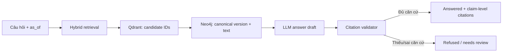
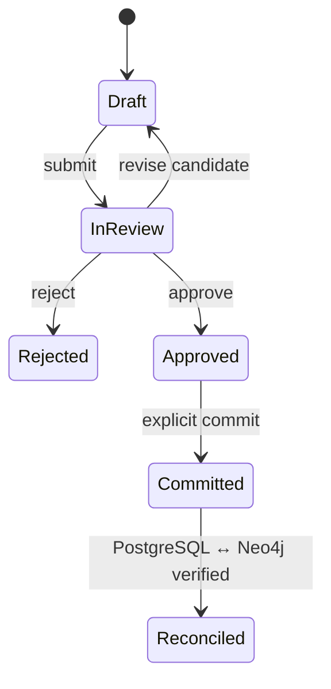
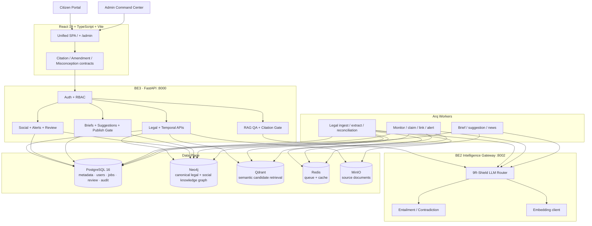

<p align="center">
  <a href="https://www.vietnamaichallenge.com/">
    
  </a>
</p>

<p align="center">
  <sub>Vietnam AI Innovation Challenge 2026 · 17–19/07/2026 · FPT Tower, Hà Nội</sub>
</p>

<h1 align="center">LexSocial AI</h1>

<p align="center">
  <strong>Biết luật nói gì. Biết luật đúng vào thời điểm nào.<br />Biết khi dư luận bắt đầu hiểu sai.</strong>
</p>

<p align="center">
  Nền tảng Legal Intelligence hợp nhất đồ thị pháp luật theo thời gian, hỏi đáp có căn cứ<br />
  và giám sát thông tin pháp lý đa nguồn trong một vòng kiểm chứng khép kín.
</p>

<p align="center">
  
  
  
  
  
</p>

<p align="center">
  <a href="#-bài-toán">Bài toán</a> ·
  <a href="#-lexsocial-ai-làm-gì">Sản phẩm</a> ·
  <a href="#-logic-chủ-chốt">Logic chủ chốt</a> ·
  <a href="#-kiến-trúc-hệ-thống">Kiến trúc</a> ·
  <a href="#-khởi-chạy-trong-5-phút">Quick start</a> ·
  <a href="#-kiểm-thử-và-bằng-chứng">Bằng chứng</a>
</p>

---

> [!IMPORTANT]
> **Bối cảnh cuộc thi.** LexSocial AI là dự án độc lập do đội **CMC 404 Not Found** phát triển cho **Vietnam AI Innovation Challenge 2026 (VAIC 2026)** — cùng sân chơi với LAWGIC của đội L‑GPT 6.7. Repository này không tuyên bố liên kết với LAWGIC và không nhận bất kỳ giải thưởng nào của họ. Banner phía trên được dẫn từ [website chính thức của VAIC 2026](https://www.vietnamaichallenge.com/) để nhận diện sự kiện.

## ✦ Một câu để hiểu dự án

**LexSocial AI biến văn bản pháp luật thành một hệ tri thức sống:** có phiên bản, có thời điểm hiệu lực, có nguyên văn kiểm chứng; sau đó dùng chính nền tri thức đó để trả lời người dân, phát hiện thông tin sai/lỗi thời trên báo chí và mạng xã hội, rồi đưa mọi quyết định nhạy cảm qua con người trước khi công bố.

Không chỉ là một chatbot. Không chỉ là một dashboard social listening. Không chỉ là một kho văn bản.

Đây là vòng lặp **Law → Evidence → Public Signal → Review → Trusted Communication**.

## 🎯 Bài toán

Thông tin pháp lý trên Internet thường thất bại ở ba điểm:

1. **Đúng văn bản nhưng sai thời điểm.** Một quy định có thể đúng khi bài viết được đăng, nhưng đã bị thay thế ở hiện tại.
2. **Câu trả lời nghe hợp lý nhưng không kiểm chứng được.** Vector search hoặc LLM có thể trả đúng chủ đề nhưng trích sai Khoản, sai phiên bản hoặc tự tạo nguyên văn.
3. **Cơ quan quản lý nhìn thấy dư luận nhưng thiếu cầu nối tới căn cứ pháp lý.** Volume và sentiment không trả lời được claim nào sai, sai ở đâu và cần đính chính bằng điều khoản nào.

LexSocial AI giải bài toán bằng một nguyên tắc xuyên suốt:

> **AI có thể tìm kiếm và đề xuất. Chỉ dữ liệu pháp lý canonical mới được dùng làm căn cứ. Những quyết định có tác động phải đi qua kiểm duyệt.**

## ⚡ LexSocial AI làm gì?

| Năng lực | Người dùng nhận được | Cơ chế tin cậy |
| --- | --- | --- |
| **Temporal Legal Graph** | Xem quy định có hiệu lực tại một ngày cụ thể và toàn bộ timeline thay đổi | Phiên bản bất biến, `lineage_id`, checksum, khoảng hiệu lực nửa mở |
| **Grounded Legal QA** | Câu trả lời đi kèm Điều–Khoản–Điểm có thể mở và kiểm tra | Qdrant chỉ tìm candidate; Neo4j cấp nguyên văn; citation validator fail-closed |
| **Amendment Intelligence** | Xem trước văn bản nào bị sửa, sửa ở đâu và thay đổi theo hướng nào | Deterministic matching, explainable score, revision guard, human review |
| **Social & News Intelligence** | Theo dõi claim pháp lý từ news, social, video/comment và forum | Provenance, content hash, evidence span, NLI hai thời điểm |
| **Misconception Radar** | Gom các phát biểu cùng hiểu nhầm, chấm risk và theo dõi tốc độ lan truyền | Tách occurrence khỏi nội dung độc lập; chống repost làm phồng cảnh báo |
| **Trusted Publishing** | Tạo brief/đề xuất đính chính và xuất bản ra Citizen Portal | RBAC, citation gate, publish gate và audit trail |

## 🧭 Hai trải nghiệm, một nguồn sự thật

### Citizen Portal — dành cho người dân

Truy cập tại `/`:

- **Trang chủ** giải thích thông tin pháp luật theo ngôn ngữ dễ hiểu.
- **Hỏi đáp pháp lý** tại `/ask`, ưu tiên citation-first và từ chối khi thiếu căn cứ.
- **Tra cứu văn bản** tại `/van-ban`, đọc cây Điều–Khoản–Điểm và file gốc công khai.
- **Bản tin pháp luật** tại `/news`, chỉ hiển thị nội dung đã qua publish gate.
- **Timeline và version compare** đã có contract giao diện, được mở dần bằng feature flag.

### Admin Command Center — dành cho đội pháp chế và truyền thông

Truy cập tại `/admin`:

- Dashboard tổng hợp sức khỏe dữ liệu và các tín hiệu cần chú ý.
- Số hóa văn bản, chạy NER, reindex vector và xem chi tiết Khoản.
- Hỏi đáp nâng cao kèm graph path.
- Theo dõi social/news, topic, bài đăng và link preview an toàn.
- Quản lý alert, review queue và misconception cluster.
- Khám phá graph neighborhood và Clarity Index.
- So sánh phiên bản, review sửa đổi và commit có chủ đích.
- Soạn brief, đề xuất đính chính, duyệt và xuất bản.
- Theo dõi job lifecycle thay vì nhận trạng thái “queued” giả.

## 🧠 Logic chủ chốt

### 1. Luật là dữ liệu theo thời gian, không phải một đoạn text tĩnh

Mỗi Điều, Khoản hoặc Điểm có hai lớp định danh:

- `lineage_id`: định danh logic xuyên suốt các lần sửa đổi;
- `node_id`: định danh vật lý bất biến của đúng một phiên bản, chứa ngày hiệu lực và checksum.

Khoảng hiệu lực dùng quy ước nửa mở `[valid_from, valid_to)`. Khi một phiên bản mới có hiệu lực, phiên bản cũ được đóng khoảng; lịch sử không bị ghi đè.

```text
01/2026/NĐ-CP::D5.K2.Pa
└── @2026-01-01#checksum-a   [2026-01-01, 2026-07-01)
    └── SUPERSEDED_BY
        └── @2026-07-01#checksum-b   [2026-07-01, ∞)
```

Vì vậy cùng một câu hỏi có thể có hai câu trả lời hợp lệ ở hai ngày khác nhau mà không làm mất khả năng kiểm toán.

### 2. Citation được dựng từ canonical text, không tin output của LLM

Luồng hỏi đáp tuân theo thứ tự:

1. Chuẩn hóa câu hỏi và ngày `as_of`.
2. Hybrid retrieval lấy candidate từ lexical/vector/graph signals.
3. Qdrant trả ID ứng viên, không được dùng làm nguồn nguyên văn.
4. Neo4j hydrate đúng physical version đang có hiệu lực.
5. LLM chỉ tạo answer draft và ánh xạ claim–citation.
6. Citation validator kiểm tra ID, ngày, checksum, quote và entailment.
7. Nếu một claim quan trọng thiếu căn cứ, contract trả `refused` hoặc `needs_review` thay vì bịa citation.



### 3. Sửa đổi pháp luật là workflow có giao dịch và người chịu trách nhiệm

Amendment Preview Engine đọc chỉ dẫn sửa đổi tiếng Việt, hydrate candidate old/new rồi chấm điểm có thể giải thích bằng:

- dẫn chiếu tường minh;
- tọa độ Điều–Khoản–Điểm;
- cấp node;
- độ tương đồng văn bản;
- thay đổi số liệu;
- hướng thay đổi thuật ngữ pháp lý.

Kết quả được phân loại bảo thủ thành `UNCHANGED`, `REWORDED`, `TIGHTENED`, `LOOSENED`, `ADDED`, `REMOVED`, `SPLIT`, `MERGED` hoặc `UNCERTAIN`.



Các guard quan trọng:

- chỉ `admin_phap_che` được review/commit;
- revision guard chống ghi đè quyết định mới hơn;
- idempotency key chống commit trùng;
- toàn batch được ghi trong một managed Neo4j transaction;
- graph thành công nhưng PostgreSQL lỗi có thể reconciliation lại an toàn;
- `SPLIT`, `MERGED`, `UNCERTAIN`, sai lineage/checksum/ngày đều không được auto-commit.

### 4. Hiểu nhầm pháp lý được kiểm tra ở hai thời điểm

Mỗi `ContentItem` từ news, mạng xã hội, video/comment hoặc forum được chuẩn hóa, lưu provenance và tách thành các claim occurrence. Hệ thống kiểm tra claim ở:

- thời điểm nội dung được đăng;
- thời điểm hiện tại hoặc ngày đánh giá được chỉ định.

Một claim chỉ nhận verdict `OUTDATED_BUT_PREVIOUSLY_TRUE` khi:

1. căn cứ lịch sử khớp claim;
2. căn cứ hiện tại mâu thuẫn claim;
3. hai căn cứ thuộc cùng lineage nhưng là hai physical version khác nhau;
4. cả hai phép kiểm tra đạt confidence threshold;
5. checksum và provenance còn nguyên vẹn.

Nếu claim đã sai từ đầu, verdict là `CONTRADICTED`. Thiếu dữ liệu là `UNVERIFIABLE`. NLI không đủ mạnh hoặc lineage bất nhất là `NEEDS_REVIEW`.

Risk score không phải một con số “AI tự nghĩ”, mà trả về từng thành phần:

- legal impact;
- source reach;
- contradiction confidence;
- velocity;
- source diversity;
- recent law change;
- engagement;
- provenance penalty.

### 5. Con người giữ quyền quyết định cuối

LexSocial AI phân biệt rõ:

- **tín hiệu** với **kết luận**;
- **draft** với **published content**;
- **approved review** với **committed graph mutation**;
- **heuristic NLI** với **production-grade NLI**;
- **local smoke evidence** với **release evidence**.

Không có đường tự động nào biến raw alert hoặc AI draft thành nội dung Citizen đã xuất bản.

## 🏗 Kiến trúc hệ thống



### Thứ bậc nguồn sự thật

| Dữ liệu | Nguồn canonical | Vai trò các hệ còn lại |
| --- | --- | --- |
| Nguyên văn và phiên bản pháp luật | **Neo4j** | Qdrant chỉ tìm ID; MinIO giữ file gốc |
| Users, jobs, review, audit, briefs | **PostgreSQL** | Redis chỉ queue/cache |
| Vector tìm kiếm | **Qdrant** | Phải parity với ID và checksum từ Neo4j |
| File PDF/DOCX/TXT | **MinIO** | Metadata liên kết được lưu trong PostgreSQL/Neo4j |
| AI draft | **Không phải nguồn sự thật** | Phải qua validator/reviewer/publish gate |

## 🧩 Technology stack

| Lớp | Công nghệ |
| --- | --- |
| Web | React 19, TypeScript 6, Vite 8, React Router, TailwindCSS, Phosphor Icons |
| Graph UI | `react-force-graph-2d`, `force-graph` |
| API | Python, FastAPI, Uvicorn, Pydantic |
| Background jobs | Arq, Redis |
| AI gateway | OpenAI-compatible chat + embedding APIs, task-aware model routing |
| Legal NLP | Parser Điều–Khoản–Điểm, OCR fallback, NER/RE, deterministic diff |
| Data | Neo4j, PostgreSQL 16, Qdrant, Redis, MinIO |
| Document processing | PyMuPDF, pdfplumber, Tesseract OCR |
| Delivery | Docker Compose cho data stack, Railway configs cho web/API/workers |
| Quality | pytest, Node test runner, oxlint, TypeScript build, acceptance catalog, shadow benchmark |

## 🗂 Monorepo map

```text
LexSocial-AI/
├── Backend/
│   ├── app/
│   │   ├── api/              # Admin, Citizen, auth và health endpoints
│   │   ├── domain/           # Temporal law, citation, amendment, misconception contracts
│   │   ├── pipelines/        # Legal, social và content pipelines
│   │   ├── services/         # Application logic và safety gates
│   │   ├── adapters/         # Neo4j, PostgreSQL, Qdrant, MinIO
│   │   ├── workers/          # Arq workers và cron jobs
│   │   └── evaluation/       # Acceptance, quality gates, shadow benchmark
│   ├── scripts/              # Seed, migrate, reindex, evaluation runners
│   └── tests/                # Backend unit/integration contract tests
├── Frontend/
│   ├── apps/web/             # Unified Citizen + Admin SPA
│   ├── packages/ui-legal/    # Shared legal UI components
│   └── tests/                # Contract tests
├── Data/
│   ├── schema/               # Neo4j/PostgreSQL/Qdrant schemas and acceptance queries
│   ├── seed/                 # Deterministic demo data
│   └── docker-compose.data.yml
├── eval/                     # Gold/prediction manifests, demo cases and reports
├── docs/                     # Architecture, ADRs, audits and implementation records
├── run.ps1                   # Unified Windows launcher
└── README.md
```

## 🚀 Khởi chạy trong 5 phút

### Yêu cầu

- Windows 10/11 + PowerShell 7 được khuyến nghị;
- Python 3.10+;
- Node.js 22+;
- Docker Desktop + Docker Compose;
- một OpenAI-compatible endpoint cho chat và embedding.

### 1. Tạo file cấu hình

```powershell
Copy-Item Backend/.env.example Backend/.env
Copy-Item Data/.env.example Data/.env
```

Tối thiểu cần điền trong `Backend/.env`:

```dotenv
APP_ENV=local
AUTH_TOKEN_SECRET=<random-secret-at-least-32-characters>
ENABLE_DEV_TOKENS=false

BE2_OPENAI_BASE_URL=https://your-openai-compatible-host/v1
BE2_OPENAI_API_KEY=<your-key>
BE2_LLM_LOCAL_MODEL=gpt-4o-mini
BE2_LLM_LARGE_MODEL=gpt-4o

BE2_EMBEDDING_BASE_URL=https://your-openai-compatible-host/v1
BE2_EMBEDDING_API_KEY=<your-key>
BE2_EMBEDDING_MODEL=text-embedding-3-small
BE2_EMBEDDING_DIMENSION=1536
```

> Qdrant collection và backend phải dùng cùng embedding dimension. Seed hiện tại mặc định là `1536`.

### 2. Khởi động data stack

```powershell
docker compose -f Data/docker-compose.data.yml --env-file Data/.env up -d
```

Các dịch vụ được mở:

| Service | Port mặc định | Mục đích |
| --- | ---: | --- |
| PostgreSQL | `5432` | Metadata, auth, jobs, review, audit |
| Neo4j | `7474` / `7687` | Browser / Bolt graph connection |
| Qdrant | `6333` | Vector search |
| Redis | `6379` | Queue và cache |
| MinIO | `9000` / `9001` | Object API / Console |

### 3. Cài dependency và chạy toàn hệ thống

```powershell
./run.ps1 -Install -Stack -Worker -Backend -Frontend
```

Những lần sau:

```powershell
./run.ps1
```

Launcher kiểm tra data stack, seed dữ liệu và mở riêng:

- BE3 FastAPI tại `http://localhost:8000`;
- BE2 intelligence gateway tại `http://localhost:8002`;
- Arq BE2 worker;
- Arq legal worker;
- React/Vite tại `http://localhost:5173`.

### 4. Mở ứng dụng

| Màn hình | URL |
| --- | --- |
| Citizen Portal | [http://localhost:5173/](http://localhost:5173/) |
| Citizen QA | [http://localhost:5173/ask](http://localhost:5173/ask) |
| Admin Command Center | [http://localhost:5173/admin/](http://localhost:5173/admin/) |
| OpenAPI / Swagger | [http://localhost:8000/docs](http://localhost:8000/docs) |
| BE3 health | [http://localhost:8000/health](http://localhost:8000/health) |
| BE2 health | [http://localhost:8002/health](http://localhost:8002/health) |

Tài khoản demo được seed cục bộ:

```text
Email:    admin@local
Password: admin123
```

Không dùng tài khoản hoặc dev token này ở staging/production.

### 5. Dừng ứng dụng

```powershell
./run.ps1 -Stop
docker compose -f Data/docker-compose.data.yml --env-file Data/.env down
```

`run.ps1 -Stop` chỉ dừng web/API process; lệnh Docker dừng data stack.

## 🛠 Chạy từng phần

```powershell
# Chỉ backend BE2 + BE3
./run.ps1 -Backend

# Chỉ frontend
./run.ps1 -Frontend

# Backend + worker
./run.ps1 -Backend -Worker

# Chỉ kiểm tra/seed data stack rồi chạy app
./run.ps1 -Stack
```

Khởi chạy thủ công:

```powershell
# Terminal 1 — BE2 intelligence gateway
Set-Location Backend
.\.venv\Scripts\python.exe -m uvicorn be2_service:app --port 8002

# Terminal 2 — BE3 API
Set-Location Backend
.\.venv\Scripts\python.exe -m uvicorn app.main:app --reload --port 8000

# Terminal 3 — frontend
Set-Location Frontend
npm run dev
```

## 🔌 API map

| Nhóm | Endpoint tiêu biểu |
| --- | --- |
| Auth | `POST /auth/login`, `GET /auth/me` |
| Legal ingest | `POST /admin/legal/upload`, `POST /admin/ingest/legal`, `POST /admin/legal/run-ner` |
| Legal read | `GET /admin/legal/van-ban`, `GET /citizen/legal/van-ban` |
| Temporal law | `GET /admin/legal/documents/{id}/as-of`, timeline và compare APIs |
| QA | `POST /admin/qa/ask`, `POST /citizen/qa/ask` |
| Social | `POST /admin/ingest/social`, crawl, topics, posts và safe link preview |
| Alerts/review | `GET /admin/alerts`, `PATCH /admin/alerts/{id}`, `GET /admin/review`, `PATCH /admin/review/{item_id}` |
| Misconceptions | list/detail/evaluate dưới `/admin/misconceptions` |
| Amendments | preview/review/decision/commit dưới `/admin/legal/amendments` |
| Knowledge graph | seeds, neighborhood và clarity index dưới `/admin/graph` |
| Publishing | briefs, suggestions và Citizen news |
| Operations | `GET /health`, `GET /admin/dashboard/summary`, `GET /admin/jobs` |

OpenAPI là nguồn contract đầy đủ tại `/docs` hoặc `/openapi.json`.

## 🔐 Security và vai trò

| Role | Phạm vi chính |
| --- | --- |
| `citizen` / anonymous | Chỉ đọc dữ liệu public và nội dung đã xuất bản |
| `admin_phap_che` | Legal review, amendment workflow, temporal misconception evaluation |
| `admin_truyen_thong` | Soạn và xuất bản nội dung truyền thông đã qua gate |
| `admin_ops` | Vận hành dữ liệu, jobs và một số luồng publish |

Safety controls hiện có:

- signed session token và expiry;
- production secret readiness hiển thị trong `/health`;
- dev token bị vô hiệu hóa ở production;
- URL preview chặn localhost, private/link-local/reserved IP, metadata host và redirect SSRF;
- lỗi database trả `503` chung, không lộ connection string;
- RBAC ở API boundary;
- immutable audit events cho amendment workflow;
- publish gate và citation gate fail-closed.

Checklist production tối thiểu:

```dotenv
APP_ENV=production
AUTH_TOKEN_SECRET=<cryptographically-random-secret-min-32-chars>
ENABLE_DEV_TOKENS=false
CORS_ALLOW_ALL=false
CORS_EXTRA_ORIGINS=https://your-admin.example,https://your-citizen.example
```

## 🧪 Kiểm thử và bằng chứng

### Kết quả gần nhất

| Gate | Kết quả |
| --- | ---: |
| Backend pytest | **285 passed** |
| Focused regression sau audit | **29 passed** |
| Frontend contract tests | **9 passed** |
| Local API smoke | **15/15 HTTP 200** |
| Neo4j acceptance | **22/22** |
| PostgreSQL acceptance | **7/7** |
| Qdrant acceptance | **8/8** |
| Local shadow reads | **120/120 passed** |
| Shadow P95 latency ratio | **1.06108** |
| Frontend production build | **Passed — 5,633 modules** |
| Python dependency check | **No broken requirements** |
| npm audit | **0 vulnerabilities** |

Kết quả được xác minh gần nhất ngày **21/07/2026** trên môi trường local/development. Local evidence không được trình bày như bằng chứng production.

### 15 API nào đã được smoke test?

Các request dưới đây chạy qua ASGI app thật và datastore local đã cấu hình; tất cả trả HTTP `200`:

| # | Method | Endpoint | Năng lực được kiểm tra |
| ---: | --- | --- | --- |
| 1 | GET | `/health` | Liveness và security readiness |
| 2 | GET | `/auth/me` | Xác thực token và identity envelope |
| 3 | GET | `/admin/dashboard/summary` | Dashboard aggregation |
| 4 | GET | `/admin/jobs` | Job lifecycle và health summary |
| 5 | GET | `/admin/review` | Review queue từ PostgreSQL + Neo4j |
| 6 | GET | `/admin/legal/van-ban` | Kho văn bản dành cho Admin |
| 7 | GET | `/admin/social/topics` | Chủ đề đang giám sát |
| 8 | GET | `/admin/social/posts` | Bài viết đa nguồn đã ingest |
| 9 | GET | `/admin/alerts` | Tín hiệu/cảnh báo hiểu nhầm |
| 10 | GET | `/admin/graph/seeds` | Điểm bắt đầu khám phá knowledge graph |
| 11 | GET | `/admin/graph/clarity-index` | Clarity risk có trọng số volume |
| 12 | GET | `/admin/briefs` | Kho nội dung truyền thông |
| 13 | GET | `/admin/suggestions` | Đề xuất đính chính |
| 14 | GET | `/citizen/news` | Chỉ nội dung đã publish |
| 15 | GET | `/citizen/legal/van-ban` | Văn bản public cho người dân |

### Chạy lại test

```powershell
# Backend
Set-Location Backend
.\.venv\Scripts\python.exe -m pytest -q
.\.venv\Scripts\python.exe -m compileall -q app
.\.venv\Scripts\python.exe -m pip check

# Frontend
Set-Location ..\Frontend
node --test tests/*.test.ts
npm run lint -w web
npm run build
npm audit --audit-level=high
```

### Evaluation và acceptance runners

```powershell
Set-Location Backend

# Contract/smoke quality gates
.\.venv\Scripts\python.exe scripts/run_lawgic_quality_gates.py `
  --manifest ../eval/manifest.smoke.json `
  --output ../eval/reports/l7-smoke-report.json

# Datastore-backed integration acceptance
.\.venv\Scripts\python.exe scripts/run_lawgic_integration_acceptance.py `
  --catalog ../Data/schema/acceptance_queries.cypher `
  --integration-config ../eval/config/integration-fixture.local.json `
  --output ../eval/reports/integration-acceptance-local.json

# Local shadow benchmark
.\.venv\Scripts\python.exe scripts/run_lawgic_shadow_benchmark.py `
  --iterations 120 `
  --output ../eval/reports/lawgic-shadow-local.json `
  --system-gold-output ../eval/fixtures/runtime/system.gold.local.json `
  --system-predictions-output ../eval/fixtures/runtime/system.predictions.local.json
```

## 🚦 Feature flags và trạng thái release

Các năng lực temporal/amendment/misconception v2 được triển khai theo additive rollout. Mặc định hiện tại:

```text
LEGAL_PROVISION_V2_WRITE=false
LEGAL_PROVISION_V2_READ=false
TEMPORAL_LAW_V2=false
QA_CITATION_V2=false
AMENDMENT_PREVIEW_V2=false
AMENDMENT_REVIEW_V2=false
AMENDMENT_COMMIT_V2=false
AMENDMENT_RECONCILIATION_MONITOR_ENABLED=false
MISCONCEPTION_CLUSTER_V2=false
MISCONCEPTION_TEMPORAL_V2=false
```

### Vì sao badge vẫn là `NO_GO`?

`NO_GO` không có nghĩa code local đang hỏng. Nó có nghĩa dự án chưa đánh tráo smoke fixture thành bằng chứng phát hành.

Trước khi bật production cần đủ ba điều kiện:

1. holdout độc lập có hai reviewer và adjudication;
2. production-grade NLI được phê duyệt cho tiếng Việt pháp lý;
3. shadow traffic trong môi trường production-like với latency/cost/failure report.

Chỉ khi evaluation runner ở chế độ release trả `GO`, đội mới cân nhắc bật từng flag theo thứ tự read → shadow → reviewed write → explicit commit.

## 🛡 Những lỗi quan trọng đã được harden

- Social ingest không còn trả “queued” khi chưa thực sự xử lý/enqueue.
- Payload thiếu `external_id` nhận deterministic ID thay vì treo job.
- Link preview chặn direct và redirect SSRF.
- Jobs/review không báo danh sách rỗng giả khi datastore lỗi.
- Lỗi login/review không lộ connection detail.
- Health phản ánh production auth config yếu/thiếu.
- Neo4j query dùng `elementId` thay cho API ID đã deprecated.
- Log tiếng Việt hoạt động an toàn trên Windows console.
- Alert volume dùng content hash để giảm ảnh hưởng của bài đăng lại.
- Amendment commit có checksum, lineage, idempotency và reconciliation guard.

Xem biên bản đầy đủ tại [`docs/PROJECT_FEATURE_AUDIT_2026-07-21.md`](docs/PROJECT_FEATURE_AUDIT_2026-07-21.md).

## 🗺 Roadmap

### Đã hoàn thành trong code/local

- [x] Legal ingest và graph Điều–Khoản–Điểm
- [x] RAG QA với canonical citation validation
- [x] Temporal legal graph và time-travel query
- [x] Amendment preview, review, commit và reconciliation
- [x] Social/news ingest và source-neutral evidence
- [x] Misconception clustering và temporal verdict
- [x] Explainable risk score và alert linkage
- [x] Admin/Citizen dual portal
- [x] Evaluation catalog T01–T20/N01–N02
- [x] CI contracts, local integration acceptance và shadow benchmark

### Trước production

- [ ] Independent legal holdout + two-reviewer adjudication
- [ ] Approved Vietnamese legal NLI
- [ ] Production-like shadow evidence
- [ ] Explicit CORS allowlist và persistent secrets
- [ ] Frontend route-level code splitting — bundle hiện khoảng 914 kB trước gzip
- [ ] Chọn và thêm giấy phép mã nguồn (`LICENSE` hiện chưa có)

## 👥 Đội ngũ

**CMC 404 Not Found**

| Vai trò | Phạm vi |
| --- | --- |
| Backend 1 · Legal Pipeline | Parser, OCR, NER, graph construction, temporal law |
| Backend 2 · Intelligence Pipeline | Social/news monitoring, topic, linking, NLI, LLM router |
| Backend 3 · API Core | FastAPI gateway, RAG, RBAC, jobs, review, publishing |
| Frontend · Product Experience | Citizen Portal, Admin Command Center, graph UI |
| Database · Data Platform | Neo4j/Qdrant/PostgreSQL/Redis/MinIO, schema, seed, lineage |

## 📚 Tài liệu sâu hơn

- [Báo cáo tiến độ LAWGIC-core](docs/BAO_CAO_TIEN_DO_LAWGIC_CMC_2026-07-21.md)
- [Architecture review](docs/lawgic-core/ARCHITECTURE_REVIEW_2026-07-21.md)
- [Implementation record](docs/lawgic-core/IMPLEMENTATION.md)
- [Research & technical decisions](docs/lawgic-core/RESEARCH.md)
- [Execution plan v2](docs/architecture/lawgic-core-execution-plan-v2.md)
- [Project feature audit](docs/PROJECT_FEATURE_AUDIT_2026-07-21.md)
- [Data stack guide](Data/README.md)

## ⚖️ Responsible use

LexSocial AI là hệ thống hỗ trợ tra cứu, phân tích và truyền thông pháp luật. Kết quả do hệ thống tạo ra:

- không thay thế ý kiến tư vấn của luật sư hoặc cơ quan có thẩm quyền;
- phải được kiểm tra với văn bản gốc và thời điểm hiệu lực;
- không được dùng để tự động ra quyết định gây ảnh hưởng pháp lý tới cá nhân;
- không được công bố như nội dung chính thức nếu chưa qua review/publish gate.

## 📄 License và attribution

Repository hiện **chưa có file `LICENSE`**. Việc mã nguồn có thể đọc được không đồng nghĩa tự động được cấp quyền sao chép, phân phối hoặc sử dụng thương mại; đội dự án cần chọn giấy phép trước khi phát hành công khai.

Banner sự kiện được dẫn trực tiếp từ website của **Vietnam AI Innovation Challenge 2026** và chỉ dùng để nhận diện cuộc thi. Quyền đối với hình ảnh và thương hiệu sự kiện thuộc các đơn vị tổ chức tương ứng.

---

<p align="center">
  <strong>LexSocial AI</strong><br />
  From legal text to living, verifiable public knowledge.<br /><br />
  Built with care by <strong>CMC 404 Not Found</strong> · 2026
</p>
