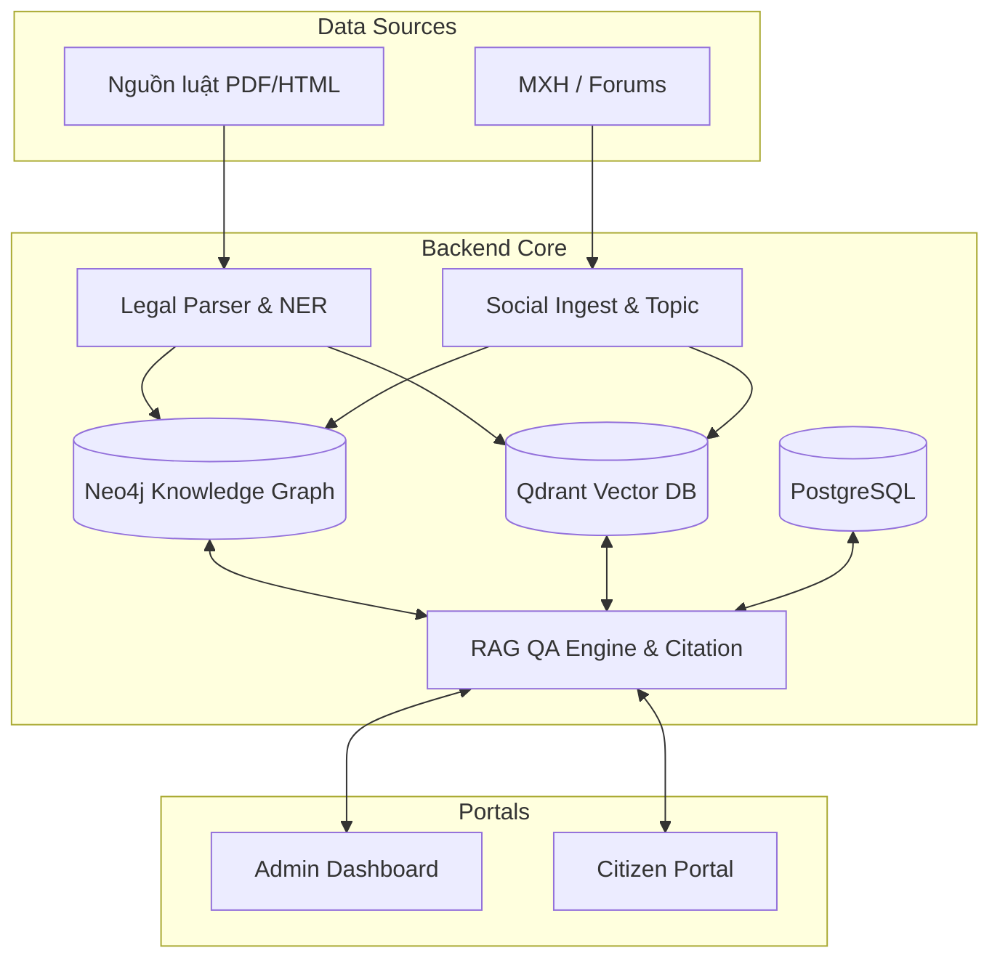

# LexSocial AI
*Được phát triển bởi đội ngũ **CMC 404 Not Found***

> Hệ thống Đồ thị Tri thức Pháp luật & Giám sát Mạng Xã hội

## 📖 Bối cảnh & Mục tiêu

Từ 01/07/2026, nhiều luật/nghị định/thông tư mới có hiệu lực. Nhu cầu nắm bắt tác động pháp lý nhanh trở nên cấp thiết, đồng thời mạng xã hội bùng nổ thảo luận và dễ nảy sinh các hiểu lầm về quy định mới.

**LexSocial AI** được sinh ra với mục tiêu xây dựng một **Knowledge Graph (Đồ thị tri thức)** hợp nhất hai miền dữ liệu:
1. **Văn bản pháp luật** (chính thống, có cấu trúc).
2. **Dư luận Mạng Xã hội** (phi chính thống).

Dự án cung cấp hai phân hệ chính:
- 🏛️ **Admin Dashboard (Dành cho Cơ quan Nhà nước):** Số hóa luật, đối chiếu phiên bản, giám sát dư luận, cảnh báo rủi ro (tin giả/hiểu lầm) và gợi ý định hướng truyền thông.
- 👥 **Citizen Portal (Dành cho Người dân):** Cung cấp tóm tắt luật dễ hiểu và hệ thống hỏi đáp AI (Q&A) có trích dẫn chính xác đến từng Điều–Khoản–Điểm.

**Nguyên tắc cốt lõi:**
- **Citation-first (Trích dẫn là ưu tiên số 1):** Mọi câu trả lời của AI và tin tóm tắt đều phải trích dẫn nguyên văn từ hệ thống.
- **Risk-bounded labeling (Đánh giá mức độ rủi ro):** Đánh giá thông tin MXH ở mức `khớp / mâu thuẫn / không rõ` thay vì phán xét đúng/sai tuyệt đối.
- **Bảo mật & Phân quyền:** Người dân chỉ tiêu thụ các dữ liệu đã được hệ thống Admin kiểm duyệt và xuất bản (`published`).

---

## 🏗️ Kiến trúc Hệ thống

Hệ thống được thiết kế dựa trên một lõi Backend chung phục vụ cho hai cổng Frontend riêng biệt.



### 1. Phân hệ Admin Dashboard
*Dành cho Cán bộ pháp chế, giám sát truyền thông, quản trị dữ liệu.*
- **Tính năng chính:** Ingest/parse luật, tìm điểm khác biệt giữa các phiên bản luật (Diff), duyệt Knowledge Graph, theo dõi MXH & cảnh báo (Alerts), duyệt đề xuất đính chính và xuất bản nội dung.

### 2. Phân hệ Citizen Portal
*Dành cho Người dân.*
- **Tính năng chính:** Đọc tin tức pháp luật tóm tắt dễ hiểu, hệ thống Chatbot QA có trích dẫn, tra cứu văn bản luật công khai.

---

## 🚀 Công nghệ sử dụng

Hệ thống kết hợp các công nghệ tối ưu cho phát triển AI & Web hiện đại:

### AI & Xử lý Ngữ nghĩa
- **LLM Router (9R-Shield):** Route linh hoạt giữa local model (Gemma) và mô hình lớn qua API dựa trên độ phức tạp.
- **Embedding:** `bge-m3` / `vietnamese-sbert` hỗ trợ tiếng Việt.
- **Xử lý văn bản:** `pdfplumber`, `PyMuPDF`, Tesseract OCR.

### Backend (Python)
- **Framework:** FastAPI (Uvicorn).
- **Task Queue:** Arq + Redis cho các tiến trình cào dữ liệu, xử lý AI ngầm.
- **Data Stack:** 
  - **Neo4j:** Đồ thị tri thức (Knowledge Graph) quản lý quan hệ thực thể.
  - **Qdrant (hoặc pgvector):** Vector Database phục vụ truy xuất (Retrieval).
  - **PostgreSQL 16:** Lưu trữ meta data (users, jobs, audit, files metadata).
  - **Redis:** Queue job & cache semantic QA.
  - **MinIO:** Object Storage lưu file PDF, HTML gốc.

### Frontend (TypeScript)
- **Core:** React 18, Vite.
- **Architecture:** Monorepo quản lý 2 apps (`admin`, `citizen`) và shared packages (`ui-legal`, `api-client`).
- **State Management & UI:** TanStack Query (React Query), Zod (Validation), Vis-network / Nivo (Vẽ đồ thị).

---

## 🛠️ Hướng dẫn Khởi chạy (Local Development)

Dự án cung cấp một script thống nhất `run.ps1` (trên PowerShell) để quản lý toàn bộ stack.

**Yêu cầu hệ thống:**
- Python 3.11+
- Node.js 20 LTS
- Docker & Docker Compose
- Ollama (cài sẵn model `bge-m3` cho embedding nội bộ)

### Các bước chạy:

1. **Khởi động Data Stack (Database & Storage):**
   Mở terminal trong thư mục gốc và chạy:
   ```bash
   docker-compose -f Data/docker-compose.data.yml --env-file Data/.env up -d
   ```
   *(Stack bao gồm: Postgres, Neo4j, Qdrant, Redis, MinIO).*

2. **Cài đặt Dependency & Chạy ứng dụng:**
   Sử dụng script `run.ps1` để cài đặt tự động (chỉ cần chạy lần đầu):
   ```powershell
   ./run.ps1 -Install
   ```
   
   Để chạy toàn bộ hệ thống (Seed data, Backend API, Workers, Frontend Admin & Citizen):
   ```powershell
   ./run.ps1
   ```

3. **Truy cập:**
   - **BE3 API (FastAPI Docs):** http://localhost:8000/docs
   - **BE2 Gateway:** http://localhost:8002/health
   - **Frontend Admin:** http://localhost:5173/admin/ (Tài khoản mẫu: `admin@local` / `admin123`)
   - **Frontend Citizen:** http://localhost:5174/citizen/ (Tài khoản mẫu: `citizen@local` / `citizen123`)

4. **Dừng hệ thống:**
   ```powershell
   ./run.ps1 -Stop
   ```

---

## 👥 Đội ngũ & Phân công (CMC 404 Not Found)

- **Backend 1 (Legal Pipeline):** Ingest → Parse (Cấu trúc hóa Điều–Khoản–Điểm) → Extract NER → Version Diff → Ghi dữ liệu vào Neo4j/Vector.
- **Backend 2 (Social & Intelligence):** Ingest mạng xã hội, phân loại Topic, liên kết bài viết với luật, NLI (kiểm tra mức độ khớp), sinh Content Brief & Suggestion, quản lý LLM router.
- **Backend 3 (API & QA Services):** Xây dựng lõi API (FastAPI), RAG QA, Authentication (RBAC), quản lý Jobs, và Publish Gate (Cổng phát hành).
- **Frontend (Dual Portal):** Xây dựng giao diện UI cho Admin & Citizen, shared components, call API.
- **Database (Data Platform):** Thiết kế schema (Neo4j, Postgres, Qdrant), seed data, backup & quản lý lineage.

---
*Dự án nằm trong khuôn khổ giải quyết bài toán Đồ thị tri thức pháp luật kết hợp phân tích mạng xã hội, ứng dụng AI giảm thiểu rủi ro pháp lý.*
